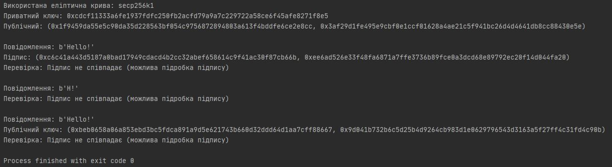
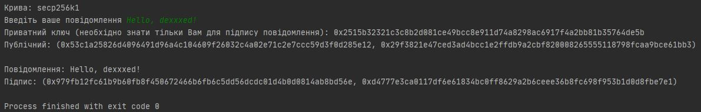
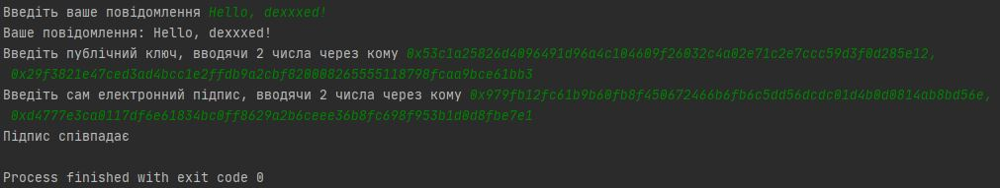
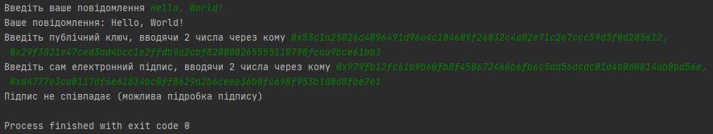

# ECDSA

*ECDSA (Elliptic Curve Digital Signature Algorithm)* — це алгоритм з
відкритим ключем для створення цифрового підпису, аналогічний за своєю
будовою DSA, але визначений, на відміну від нього, не над полем цілих
чисел, а в групі точок еліптичної кривої.

Стійкість цього алгоритму ґрунтується на проблемі дискретного
логарифмування в групі точок еліптичної кривої. На відміну від проблеми
простого дискретного логарифма і проблеми факторизації цілого числа, не
існує суб-експоненціального алгоритму для проблеми дискретного логарифма
в групі точок еліптичної кривої. З цієї причини «сила на один біт ключа»
набагато вище в алгоритмі з еліптичними кривими.

Для генерування та перевірки підписів були написані скрипти на мові
Python 3. Результат роботи скриптів представлений на скриншотах нижче.

`script.py`

`sign.py`

`check.py`

